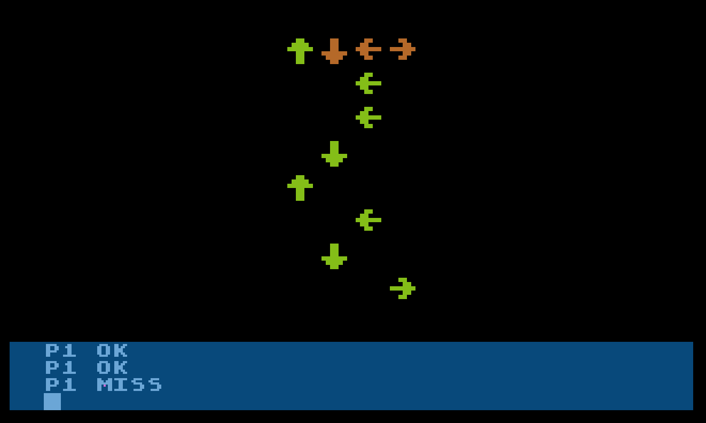

# 10line-2015-JoyJoyRevolution
Joy Joy Revolution game in Turbo BASIC XL for Atari 8-bit. Entry for 2015 10-line BASIC contest

Here's Joy Joy Revolution, a party game for up to 4 simultaneous players (requires up to 4 joysticks on an Atari 400/800.)
 
It's Dance Dance Revolution but with joysticks.
 
Things that I like about it: with 1 player, you play the whole chord when you get a direction right. With 2 players, each player gets two notes of the chord, so it sounds best when both people are accurate. With 4 players, each person plays one note of the chord. I like that it keeps track of players' accuracy.
 
Things that I don't like: speed is uneven as levels progress. With four players, level one stats way too fast. It's pretty frantic. Also I think a couple of the notes aren't in tune. I just don't have time to fix it before the deadline.
